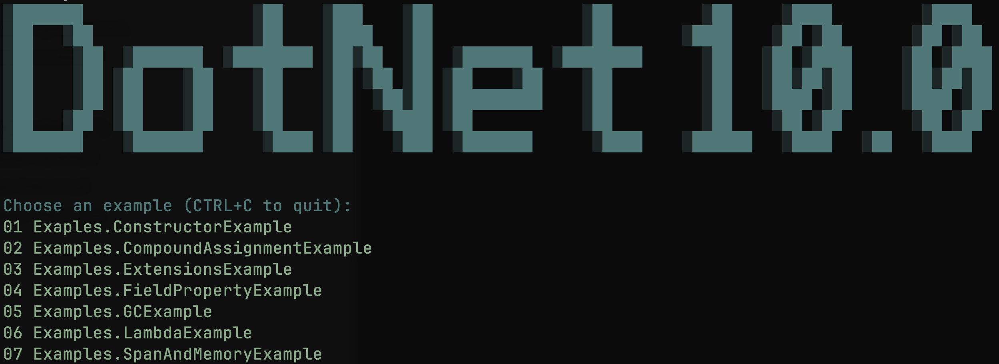

# .NET 10 Console Demo

A hand-crafted C# console app with some of the latest features of .NET 10. I took some of the latest features of C# to practise new constructs.

## No AI

No AI was used in this project. Coded by hand with Neovim on macOS.

## Screenshots

## Urls

I used Ascii art from this website: [patorjk.com](https://patorjk.com/software/taag/#p=display&f=Terrace&t=DotNet+10.0&x=none&v=4&h=4&w=80&we=false)
